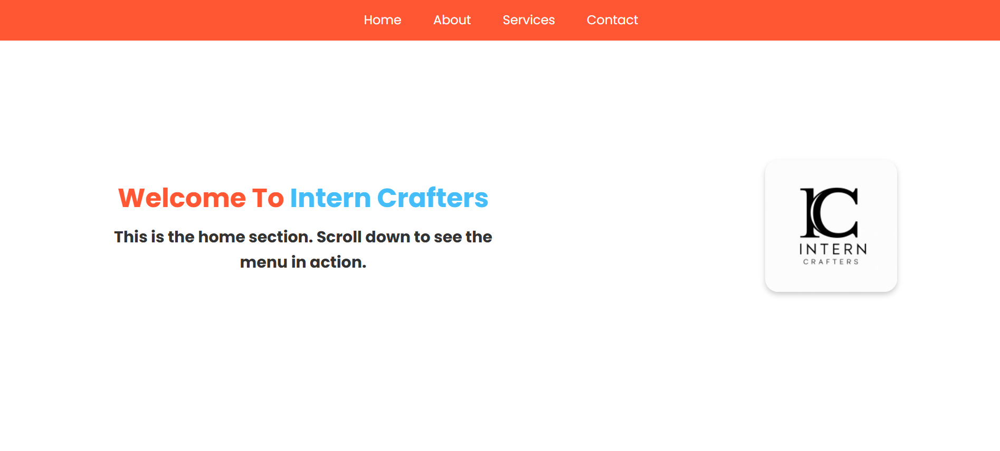

# INTERNCRAFTERS_WD_01

<p align="center">
<a href="#"></a>
</p>
<p align="center">
<a href="https://github.com/vxnuprasad"></a>
<a href="https://interncrafters.netlify.app/"></a>
</p>

# Interactive Navigation Menu (Scroll and Hover Effects)

This project features an interactive, responsive navigation menu that changes color or style when scrolled or hovered over. The navigation menu is fixed in position, ensuring it is always visible on all pages, and provides a seamless, user-friendly interface.

## Features

1. **Fixed Position:** The menu stays at the top of the page, even as the user scrolls through the content.
2. **Hover Effects:** Menu items change style, such as font color or background, when hovered over.
3. **Scroll-Based Changes:** The background color or style of the menu dynamically changes as the user scrolls.
4. **Responsive Design:** Works perfectly on various screen sizes, including mobile and desktop.
5. **Lightweight:** Utilizes HTML, CSS, and JavaScript for optimal performance.

---

## How It Works

1. **HTML Structure:** Defines the navigation menu and sections of the page.
2. **CSS Styling:** Adds elegant design and hover effects to the menu items. Ensures responsiveness.
3. **JavaScript Interactivity:**
   - Tracks scroll events to change the menu's background.
   - Highlights the active section based on the current scroll position.

## Usage

### Clone the Repository:
```sh
git clone https://github.com/vxnuprasad/INTERNCRAFTERS_WD_01
```

### Open in Browser:
1. Navigate to the project folder.
2. Open the `index.html` file in any web browser to view the interactive navigation menu.

---

## Contributions

If you find this project helpful, consider following [vxnuprasad](https://github.com/vxnuprasad) on GitHub! Feel free to fork the repository and make your contributions.

---

## Technologies Used

- **HTML**: For structuring the menu and content.
- **CSS**: For styling, hover effects, and responsiveness.
- **JavaScript**: For interactivity, including scroll and hover effects.

---

## Find Me On:
[](https://www.linkedin.com/in/vxnuprasad)  
[](https://www.instagram.com/__.v.shnu/)  
